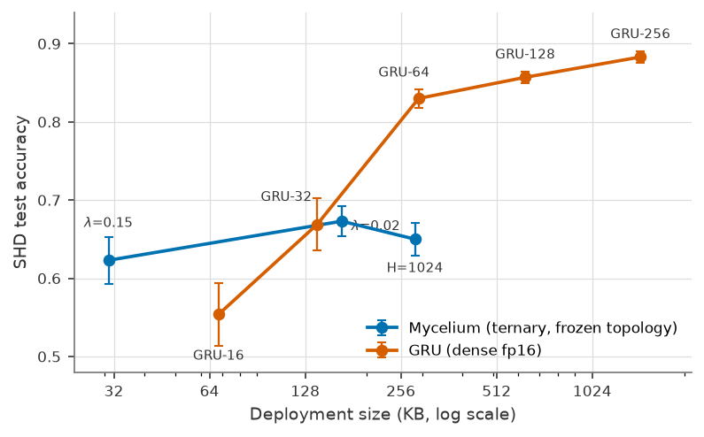

# Mycelium 🍄

**A verification-first spiking neural network derived from the
[CeliumNeUR](https://github.com/terrizoaguimor/celiumneur) chip's constraint set.**

[](LICENSE)
[](paper/mycelium.pdf)
[](https://doi.org/10.5281/zenodo.21925426)

Most SNN papers propose neuron dynamics and assert hardware efficiency against
silicon that does not exist. This project inverts the direction: it takes a
neuromorphic SoC with **verified RTL** — golden model, mutation testing, bounded
formal checks — and derives the trainable model *from the chip's constraint
set*: ceiling leak, saturating int16 membranes, saturating int8 weights,
per-neuron thresholds/leak/refractory, tick-synchronous phases, static routing.

The result is a recurrent **block-sparse ternary** architecture whose forward
pass is **bit-identical to the chip's golden model** under an explicit
five-condition contract, whose learned topology is **frozen into a hashable
artifact**, and whose deployment instance replays through the integer
reference with **zero mismatches** after training on real data:

```
task-trained weights ≡ integer model ≡ golden referee ≡ verified RTL
```

## Headline results (SHD, 3 seeds per point)



| | |
|---|---|
| **Memory frontier** | Mycelium **62.3% ± 3.0 @ 31 KB** vs GRU-16 fp16 55.4% ± 4.0 @ 68 KB — the families cross near ~140 KB; dense wins above ~300 KB |
| **Topology as a result** | L0 gating **deleted the recurrent synapse entirely** on SHD (−1.9 pts, 3× fewer ops) — the task didn't pay for recurrence and the learner found out |
| **Quantization is free** | A float-weight ablation **lost** to ternary under identical dynamics |
| **Deployment certificate** | 34 neurons / 832 synapse entries (inside the v1 silicon budget), 74.9% on 2-class SHD, **0 logit mismatches** in the IntLIF replay, SHA-256 artifact |
| **Membrane readout** | +2.6 pts and half the seed variance vs a spike-count head, chip-honest via the RTL's non-invasive readback |

Full story, tables and limitations: [`paper/mycelium.pdf`](paper/mycelium.pdf)
(draft) · markdown twin: [`WRITEUP.md`](WRITEUP.md).

## Quickstart

```bash
git clone --recurse-submodules https://github.com/terrizoaguimor/celiumsnn
cd celiumsnn
python3 -m venv .venv
.venv/bin/pip install torch --index-url https://download.pytorch.org/whl/cpu
.venv/bin/pip install pytest h5py numpy matplotlib
.venv/bin/python -m pytest        # 78 tests, incl. bit-exactness vs the chip's golden model
```

Train the headline model on Spiking Heidelberg Digits (downloads SHD on first run):

```bash
.venv/bin/python experiments/p5_shd.py --part myc-gated-512 \
  --theta0 48 --dropout 0.25 --lr 1e-2 --epochs 60 --cosine \
  --readout membrane --data-dir ./data/shd
```

## What's in the box

| Path | What it is |
|---|---|
| `celiumsnn/lif.py` | `IntLIF` — integer tick-synchronous neuron, bit-exact vs golden |
| `celiumsnn/lif_diff.py` | `DiffLIF` — differentiable twin (surrogate + STE), forward identical to `IntLIF` |
| `celiumsnn/synapse.py` | `EdgeListSynapse` (chip-exact dendrite table) · `BlockSparseSynapse` (GPU form) |
| `celiumsnn/gates.py` | Hard-concrete L0 topology learning → `freeze()` → SHA-256 artifact |
| `celiumsnn/model.py` | `Mycelium` — the macro-architecture |
| `celiumsnn/snntorch_adapter.py` | `CeliumLeaky` — drop the neuron into snnTorch loops |
| `tests/` | 78 tests: golden equivalence (soma + full 1,024-neuron chip), contract boundaries, gradients |
| `experiments/` | Every experiment + its JSON results (P2 gradient gate → P7 stability) |
| `paper/` | LaTeX source, figure generator, compiled PDF |
| `celiumneur/` | The chip, as a pinned submodule — RTL, SPEC, golden model, verification gates |
| `P0…P7-REPORT.md`, `DECISIONS.md` | The lab notebook: every phase, every null result, kill criteria ratified up front |

## The equivalence contract, in one paragraph

The chip's golden model evaluates fire per synaptic event; a batched GPU model
evaluates per tick. `P0-SEMANTICS.md` defines the five conditions (C1–C5)
under which end-of-phase state equality is **exact**, and every boundary is
pinned by an explicit divergence test rather than hidden. Under the contract,
equality is verified on 10⁵+ fuzzed neuron-phases and full-chip simulations
(mesh, dendrite tables with true duplicate multiplicity, somas) with delivery
routed through the same sparse primitive used for training.

## Citation

```bibtex
@misc{gutierrez2026mycelium,
  author = {Guti{\'e}rrez, Mario},
  title  = {Mycelium: A Verification-First Spiking Network from the CeliumNeUR Constraint Set},
  year   = {2026},
  note   = {Working draft. Code: github.com/terrizoaguimor/celiumsnn},
}
```

Chip: Gutierrez, M. (2026). *CeliumNeUR — a verification-first neuromorphic
SoC v1*. [doi:10.5281/zenodo.21925426](https://doi.org/10.5281/zenodo.21925426).

## License

Apache-2.0 (this repo and the chip's code; chip documentation CC BY 4.0).
